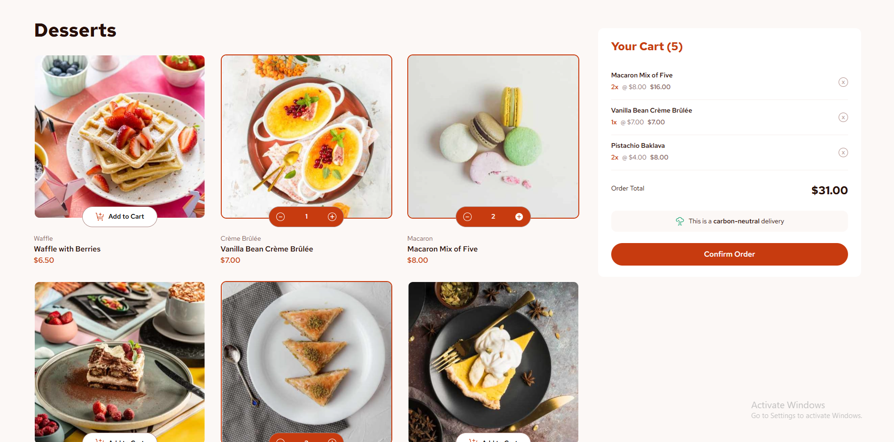

# Frontend Mentor - Product list with cart solution

This is a solution to the [Product list with cart challenge on Frontend Mentor](https://www.frontendmentor.io/challenges/product-list-with-cart-5MmqLVAp_d). Frontend Mentor challenges help you improve your coding skills by building realistic projects. 
### The challenge

Users should be able to:

- Add items to the cart and remove them
- Increase/decrease the number of items in the cart
- See an order confirmation modal when they click "Confirm Order"
- Reset their selections when they click "Start New Order"
- View the optimal layout for the interface depending on their device's screen size
- See hover and focus states for all interactive elements on the page

### Installation & Setup
Make sure you have Node.js and npm (or yarn) installed.

# Clone the repository
git clone https://github.com/your-username/product-list.git
cd product-list

# Install dependencies
npm install  # or yarn install

Running the Project

# Start the development server
npm run dev   # or yarn dev

# Build the project for production
npm run build # or yarn build

### Screenshot

### Links

- Solution URL: [Add solution URL here](https://your-solution-url.com)
- Live Site URL: [Add live site URL here](https://your-live-site-url.com)

### Built with

- React - JavaScript library for building UI
- Tailwind CSS - Utility-first CSS framework
- Vite - Fast frontend tooling
- Mobile-first design approach

### What I learned

## Author

- Frontend Mentor - [@yourusername](https://www.frontendmentor.io/profile/thentrsfs)

## Acknowledgments

